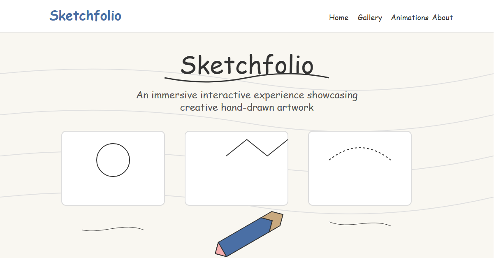

# Sketchfolio - Interactive Hand-Drawn Art Portfolio

A creative, interactive portfolio showcasing hand-drawn artwork through animations and interactive experiences. Built with Next.js, Anime.js, and a hand-drawn aesthetic.



## Features

- **Hand-drawn animations** using Anime.js
- **Interactive drawing components** allowing visitors to create their own artwork
- **Paper physics simulation** with Matter.js
- **Responsive design** that works on all devices
- **Filterable art gallery** to showcase artwork by category
- **Contact form** for commissions and inquiries

## Tech Stack

- **Next.js** - React framework for production
- **TypeScript** - For type safety
- **Anime.js** - For smooth animations
- **Matter.js** - For physics simulations
- **Framer Motion** - For UI animations
- **CSS Modules** - For component-scoped styling

## Getting Started

### Prerequisites

- Node.js 18.17.0 or later
- npm or yarn

### Installation

1. Clone the repository
```bash
git clone https://github.com/SallahBoussettah/sketchfolio.git
cd sketchfolio
```

2. Install dependencies
```bash
npm install
# or
yarn install
```

3. Run the development server
```bash
npm run dev
# or
yarn dev
```

4. Open [http://localhost:3000](http://localhost:3000) in your browser

## Deployment to Netlify

This project includes a `netlify.toml` file for easy deployment to Netlify.

### Deploy with Netlify CLI

1. Install Netlify CLI
```bash
npm install -g netlify-cli
```

2. Login to Netlify
```bash
netlify login
```

3. Deploy
```bash
netlify deploy
```

### Deploy via GitHub Integration

1. Push your code to GitHub
```bash
git add .
git commit -m "Ready for deployment"
git push origin main
```

2. Connect your repository to Netlify:
   - Go to [Netlify](https://app.netlify.com/)
   - Click "New site from Git"
   - Select GitHub and the repository
   - Select the main/master branch
   - Deploy settings will be automatically read from `netlify.toml`

## Project Structure

```
/
├── public/                # Static assets
├── src/
│   ├── app/               # Next.js app router pages
│   ├── components/        # React components
│   │   ├── animations/    # Animation components
│   │   ├── gallery/       # Gallery components
│   │   ├── interactive/   # Interactive components
│   │   └── layout/        # Layout components
│   ├── styles/            # Global styles
│   └── types/             # TypeScript types
├── .next/                 # Next.js build output
├── netlify.toml           # Netlify configuration
└── package.json           # Project dependencies and scripts
```

## Customization

To customize the portfolio for your own use:

1. Update the artwork in `src/components/gallery/ArtworkGallery.tsx`
2. Edit content in `src/app/page.tsx`
3. Modify animations in the components folder
4. Update contact information in the contact form section

## License

This project is licensed under the MIT License - see the LICENSE file for details.

## Acknowledgments

- Inspired by hand-drawn art and interactive web experiences
- Special thanks to the creators of Anime.js and Matter.js
- Built with love and creativity

---

Created by [Your Name] - [Your Website/Social]
